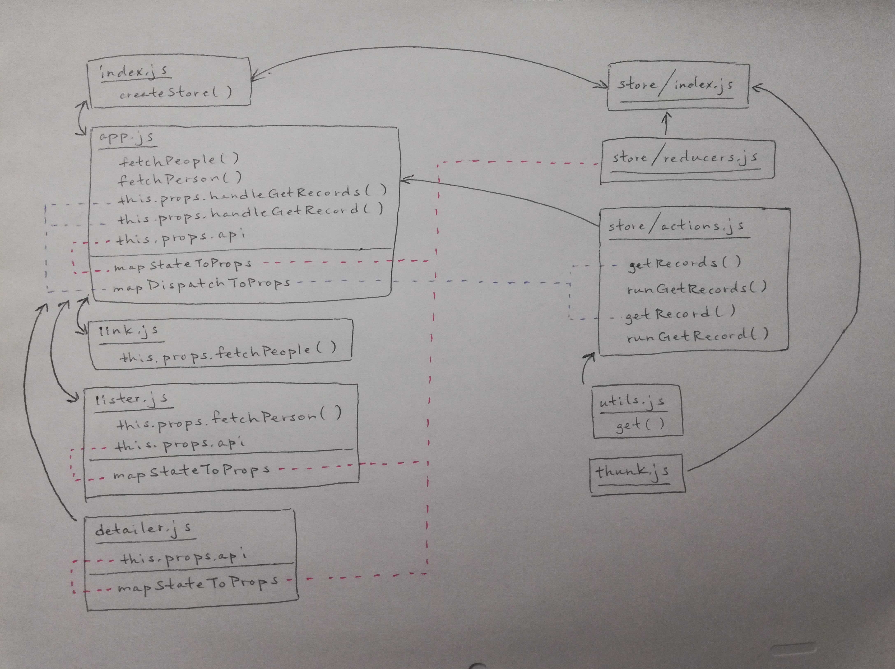

 LAB 33
=================================================

## Remote APIs

### Author: Katherine Smith

### Links and Resources
* [CodeSandBox](https://codesandbox.io/s/6l75k2599k)

### Modules
#### `index.js`
- Imports the App component
- Creates the store and connects to the store
- Contains the Main component
  - Passes the store down to the App component
  - Renders the App component
#### `app.js`
- Imports the Link component, the Lister component, and the Detailer component
- Imports actions from the store
- Contains the App component
  - Contains own state for url
  - Contains the fetchPeople() method which handles fetching records from url
  - Contains the fetchPerson() method which handles fetching record from url
  - Passes the fetchPeople() method to the Link component
  - Passes the fetchPerson() method to the Lister component
  - Renders the Link component, the Lister component, and the Detailer component
- Contains mapStateToProps() which maps api state to props
- Contains mapDispatchToProps() which maps api dispatch to props
- Exports the connected App component
#### `link.js`
- Contains the Link component
  - Renders the link
- Exports the Link component
#### `lister.js`
- Contains the Lister component
  - Renders the list of records
- Contains mapStateToProps() which maps api state to props
- Exports the connected Lister component
#### `detailer.js`
- Contains the Detailer component
  - Renders the details from record
- Contains mapStateToProps() which maps api state to props
- Exports the connected Detailer component

### Store Modules
#### `index.js`
- Imports reducers and thunk
- Exports function to create the store
#### `actions.js`
- Contains getRecords() and getRecord() as actions to be dispatched
- Contains runGetRecords() as helper function for getRecords
- Contains runGetRecord() as helper function for getRecord
#### `reducers.js`
- Maintains state for the store
#### `thunk.js`
- Provides middleware for the store

### Library Modules
#### `utils.js`
- Contains and exports get() function for superagent get requests

#### UML
